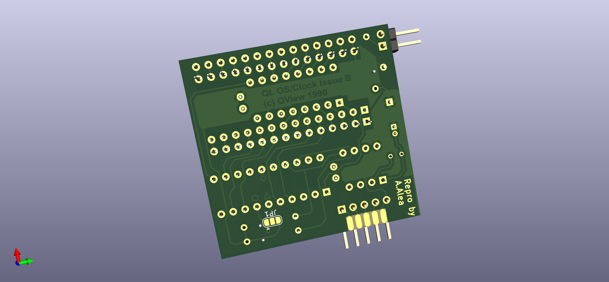
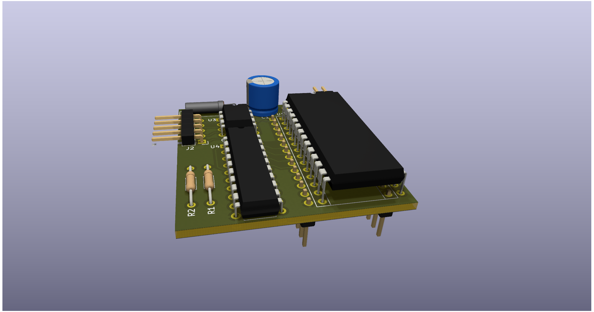

# SINCLAIR QL - Minerva MK II - New OS + RTC

In 2024 by Alvaro Alea Fernandez

License under: CERN Open Hardware Licence Version 2 - Strongly Reciprocal

https://ohwr.org/cern_ohl_s_v2.txt

## THIS BOARD HAS NOT BEEN TESTED, IS WORK IN PROGRESS, NO WARRANTY OF WORKING

My work is only copy the design to Kicad, all (C) are retaing to the original owners.

U1 shall be mounted in the solder side, in a way that allow to insert on the Sinclair QL's Rom socket.

Original Information of minerva can be found here: http://tfs.firshman.co.uk/ql/minerva.htm

A generic description here: https://wiki.qlforum.co.uk/doku.php?id=qlwiki:minerva

Manuals and software here: https://dilwyn.qlforum.co.uk/docs/manuals/index.html

Main information, GAL code, pictures, etc... has been obtained from this post: https://qlforum.co.uk/viewtopic.php?t=1993

ROM Chip shall be installed as per this picture:

